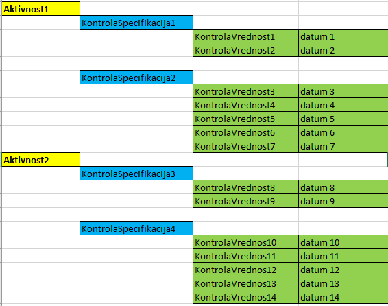

##############
KONTROLNI LIST
##############

Struktura
#########

.. _kontrolni-list-osnovna-shema:

Osnovna shema
-------------

.. figure:: images/osnovna_struktura.png

    Osnovna shema kontrolnega lista

.. _kontrolni-list-struktura-izpis:
Struktura izpis
---------------

.. _kontrolni-list-definicije-pojmov:

Definicije pojmov
-----------------

.. glossary::

    Aktivnost
        Sklop kontrol, ki se izvajajo z določenim namenom

    KontrolaSpecifikacija
    	Definira kaj se kontrolira, kako se kontrolira in vrsto vnosa vrednosti kontrole
        (check, text, select)

    KontrolaVrednost
        Ugotovljena vrednost specificirane kontrole

    KontrolaSpecifikacijaOpcijaSelect
        Zaloga vrednosti pri načinu kontrole z izborom vrednosti - “select”

    Opravilo
        Povezava na opredelitev: :ref:`delovni-nalogi-definicije-pojmov`

    DelovniNalog
        Povezava na opredelitev: :ref:`delovni-nalogi-definicije-pojmov`

Models
######

.. _kontrolni-list-aktivnost-model:

Aktivnost Model
---------------

opravilo
^^^^^^^^

+---------------+----------------------------------------------------+
| specifikacija | vrednost                                           |
+===============+====================================================+
| field         | opravilo                                           |
+---------------+----------------------------------------------------+
| opis          | Relacija na opravilo kjer se bo aktivnost izvajala |
+---------------+----------------------------------------------------+
| Type          | models.ForeignKey                                  |
+---------------+----------------------------------------------------+
| MaxLength     | /                                                  |
+---------------+----------------------------------------------------+
| blank         | True                                               |
+---------------+----------------------------------------------------+
| null          | True                                               |
+---------------+----------------------------------------------------+
| verbose_name  | Opravilo                                           |
+---------------+----------------------------------------------------+

projektno_mesto
^^^^^^^^^^^^^^^

+---------------+----------------------------------------------------+
| specifikacija | vrednost                                           |
+===============+====================================================+
| field         | projektno_mesto                                    |
+---------------+----------------------------------------------------+
| opis          | Aktivnost se izvaja na specificiranih projektnih   |
|               | mestih (ProjektnoMesto). Podlaga za servisno       |
|               | knjigo.                                            |
+---------------+----------------------------------------------------+
| Type          | models.ManyToManyField                             |
+---------------+----------------------------------------------------+
| MaxLength     | /                                                  |
+---------------+----------------------------------------------------+
| blank         | True                                               |
+---------------+----------------------------------------------------+
| null          | False                                              |
+---------------+----------------------------------------------------+
| verbose_name  | Projektno mesto                                    |
+---------------+----------------------------------------------------+

.. _kontrolni-list-kontrola-specifikacija-model:

KontrolaSpecifikacija Model
---------------------------

.. _kontrolni-list-kontrola-vrednost-model:

KontrolaVrednost Model
---------------------------

Views
######

KontrolniListUpdateOblika01View
-------------------------------

.. glossary::

    Namen
        Izpolnjevanje e-kontrolnega lista združeno po aktivnosti

    Url path
        /moduli/kl/{pk}/update-oblika01

    Url namespace
        update_oblika01

    Template
        kontrolnilist/update_oblika01.html

KontrolniListUpdateOblika02View
-------------------------------

.. glossary::

    Namen
        Izpolnjevanje e-kontrolnega lista združeno po projektnih mestih

    Url path
        /moduli/kl/{pk}/update-oblika02

    Url namespace
        update_oblika02

    Template
        kontrolnilist/update_oblika02.html

KontrolniListPrintOblika01View
------------------------------

.. glossary::

    Namen
        Tiskanje obrazca kontrolnega lista združeno po aktivnosti

    Url path
        /moduli/kl/{pk}/print-oblika01

    Url namespace
        update_oblika01

    Template
        kontrolnilist/print_oblika01.html

KontrolniListPrintOblika02View
------------------------------

.. glossary::

    Namen
        Tiskanje obrazca kontrolnega lista združeno po projektnih mestih

    Url path
        /moduli/kl/{pk}/print-oblika02

    Url namespace
        update_oblika02

    Template
        kontrolnilist/print_oblika02.html
