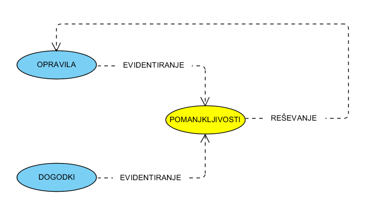

====================================
PRIJAVA IN REŠEVANJE POMANJKLJIVOSTI
====================================
====================================

PRIJAVA POMANJKLJIVOSTI
#######################

Prijava pomanjkljivosti iz dveh virov:
* Opravila (med izvedbo del / kontroliranjem)
* Dogodki (ugotovitve zunanjih, Škodni dogodki (strojelomi, viharji, ...))

Evidentiranje iz Opravil
------------------------
Pri izvajanju rednih pregledov se v delovnem nalogu evidentirajo pomanjkljivosti.

Evidentiranje preko dogodkov
----------------------------
Evidentirajo se dogodki v katerih so navedene neskladnosti. Te neskladnosti se evidentirajo kot pomanjkljivosti.
Glej reševanje dogodkov.

Osnovna struktura

REŠEVANJE POMANJKLJIVOSTI
#########################

#. Zabeležka opravil kjer se pomanjkljivost rešuje
#. Pomembni zaznamki v vezi z pomanjkljivostjo
#. Dogodki vezani na pomanjkljivost

Zabeležka opravil kjer se pomanjkljivost rešuje
-----------------------------------------------

Pomembni zaznamki v vezi z pomanjkljivostjo
-------------------------------------------

Dogodki vezani na pomanjkljivost
--------------------------------
